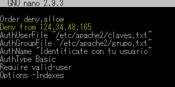

# Ejercicios con .htaccess
##### Mediante el uso de un fichero .htaccess:

- Deshabilitar la opción de listar los ficheros en ese directorio.

- Protege tu directorio y ficheros con autenticación básica.

- Hacer que los ficheros “.txt” no sean accesibles.

- Crear una lista de IPs prohibidas

